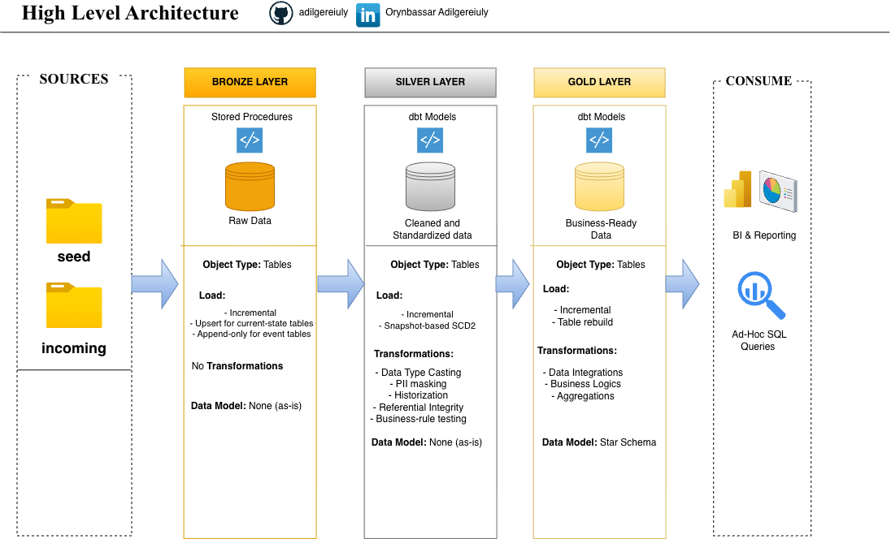
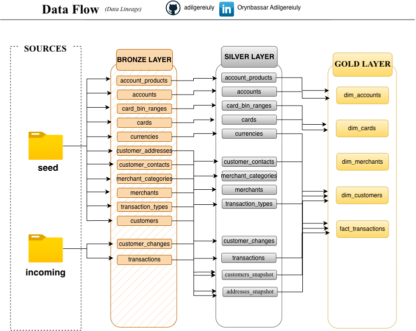

# Banking Data Pipeline

A simulated core-banking ELT pipeline

Bronze → Silver → Gold medallion architecture on Postgres + dbt, orchestrated with Airflow.


---

## Architecture

**Bronze** lands raw source data untouched. 


**Silver** (dbt) casts types, historizes customers/addresses via SCD2, and masks PII. 


**Gold** (dbt) assembles a Kimball star schema ready for BI.



Bronze:


Tables via stored procedures. 


Upsert for current-state entities, append-only for events.


No transformations: raw VARCHAR, a faithful copy of source.

Silver:


dbt models, snapshot-based SCD2. 


Type casting, PII masking, historization, referential integrity, business-rule testing.

Gold:


dbt models, incremental fact + table-rebuilt dims. 


Business logic, integration, and aggregation into a Kimball star schema.
### Data lineage



Two source folders feed Bronze:
- **`seed/`** — the already existing state of the bank (customers, accounts, cards,..), loaded once
- **`incoming/{date}/`** — each simulated day's new activity (transactions, customer changes,..), loaded daily

---

## Why this stack

Postgres, dbt, and Airflow:

Postgres for its demand & popularity within the Data Engineering and Analytics domains.

dbt for shaping Silver/Gold transformations into version-controlled, testable SQL, so that every model is compiled, documented, and covered by tests instead of being a one-off script nobody can safely modify. Snapshots give SCD2 historization for free, without hand-rolled window-function logic. And because dbt builds a DAG of the pipeline, it kind of knows exactly what needs to rerun and what comes after what, which is also what makes it a natural fit for orchestration.

and Airflow because logically, the whole process needs to be orchestrated and Airflow fully owns that domain.

---

## The simulated source system

Since there's no real bank feeding this pipeline, a Python generator simulates the upstream core banking system:

**`gen_seed.py`** — run once.


Produces the baseline: 


500 customers, 1,000 accounts, 600 cards, 80 merchants + static lookup tables.

**`gen_daily_batch.py`** — run once per simulated day.


Produces:


that day's transactions (150–400)


customer profile changes (~1–3% of active customers)


and organic growth (0–5 new customers).

## Engineering highlights

**Bronze: idempotent, upsert-based loading.** 


13 stored procedures follow the same pattern: 


truncate staging → `COPY` the CSV in → upsert into Bronze (`ON CONFLICT DO UPDATE` for current-state tables, 


`ON CONFLICT DO NOTHING` for append-only event tables like `transactions`). 


No transformations, no constraints beyond primary key


Bronze's only job is to be a trustworthy, unmodified fallback for auditing.

**Silver: SCD2 via dbt snapshots, not hand-rolled SQL.** 


The hardest problem in this layer: bronze.customers only holds each customer's latest state & it doesn't know a status changed, only what it changed to. But SCD2 historization needs something that changes over time to snapshot against. The fix is a two step resolve, then track pattern: an intermediate model merges the base customer record with the latest event to produce one clean "current state" row per customer, and a dbt snapshot compares that output run over run, automatically closing out old versions and opening new ones whenever something changes, with no hand-written versioning logic.

**Gold: merging two independently-timed SCD2 timelines.**

dim_customers needs to combine a customer's status history with their address history, but those two timelines almost never change on the same day, a naive join would misalign them, pairing a status from one point in time with an address from another. The fix: treat every date either timeline changed as a checkpoint, then for each checkpoint, work out what was true in both histories at that exact moment. The result is one merged timeline that's always internally consistent. fact_transactions then looks up, for each transaction, the version of the customer that was actually true at that transaction's timestamp.

**PII handling.** 


Masking is applied inside Silver's models, so Bronze stays fully raw for lineage while everything downstream only sees masked values: partial name masking, age brackets, partially masked email/phone, and street-level address redaction.

I didn't do tokenization because it needs a separate access controlled vault, which isn't meaningfully demonstrable solo.

**Business rules as tests, not constraints.** 

Validation like accepted status values and date-range sanity lives in dbt tests instead of DB `CHECK` constraints because a hard constraint halts the whole pipeline whereas a test would have simply flagged it without blocking the run.


---

## Data quality

**62 dbt tests** across Silver and Gold:
- `not_null` / `unique` on every primary key and surrogate key
- `accepted_values` on every status/type enum
- `relationships` for referential integrity across every foreign key
- Singular tests:


  valid date ranges on both snapshot tables,


  purchase transactions must have both card and merchant,


  non-purchase transactions must have neither,


  every transaction must resolve to a customer

---

## Repo structure

```
BankingDataPipeline/
├── generator/           # gen_seed.py, gen_daily_batch.py — simulated core banking source
├── bronze/               # staging_ddl.sql, bronze_ddl.sql, proc_load_bronze.sql
├── dbt/
│   ├── models/
│   │   ├── staging/       # source.yml — Bronze source declarations
│   │   ├── silver/        # 13 models + int_customers_current / addresses_current
│   │   └── gold/          # 4 dims + 1 fact
│   ├── snapshots/         # customers_snapshot, addresses_snapshot
│   ├── tests/              # singular SQL tests
│   └── macros/
├── airflow/               # DAG definition
└── docs/
```
